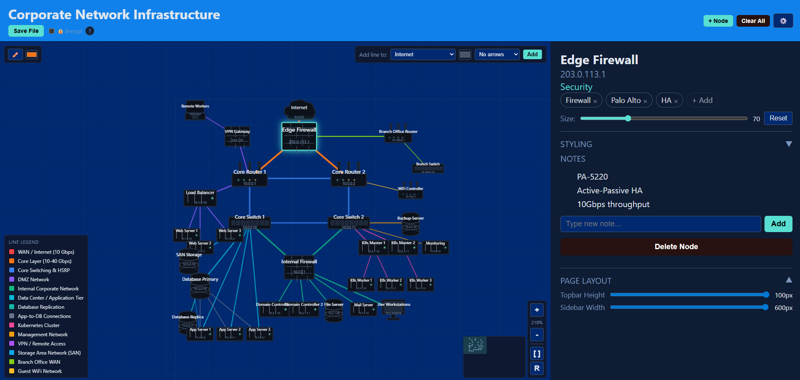
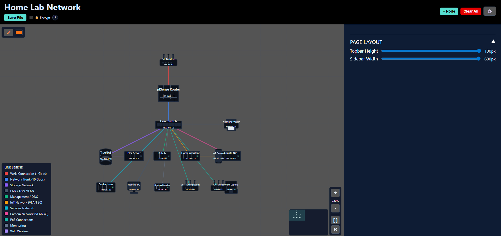
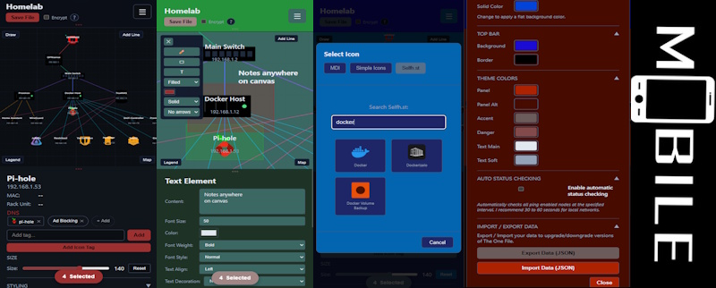

# The One File - Network Topology Maker

In the end there can only be "The ONE File". A portable and completely self contained network topology builder. The canvas, the logic, the settings, your nodes, your connections, and your notes all live inside a single standalone HTML file. Any modern browser can open and edit it without any prior setup. (is the idea)

  

## New Updates 11/25/25!
- Version 1.90 brings a few additions and a few more fixes.
- Mobile menu added.
- Can now hide the line legend. (only pops up after the first line is added)
- Can now be exported as a png or svg!
- Import / Export data to upgrade/downgrade The One File version.
- Free drawn lines now have styling. Full, dashed and dotted along with arrow directions!
- Mobile footer styling.
- Bug fixes: (Too many to count. Squashed many bugs in both desktop and mobile)

## What's next?
- Version 2.0 with a seperate "online" option that adds self hosted icons from
- Simple icons or Material
- Selfh.st self hosted icons

## Why It Exists

I wanted a tool that is:

- fully offline  
- portable  
- zero setup  
- stable  
- fast  
- dependable in emergencies 

Instead of building another hosted application, I built a file.

## What You Can Use It For
- Homelab mapping  
- Office network layouts  
- Rack diagrams  
- VLAN and subnet planning  
- Mind Maps
- Logical and physical maps  
- Encrypted break glass documentation  
- Offline or air gapped environments  
- Sharing a topology by sending a single file

## Features
- Zero coding knowledge required    
- Zero config files

### Canvas and Navigation
- Large zoomable and pannable workspace  
- Minimap with viewport tracking  
- Works with touch and mobile  
- Clear grid and boundary indicators  

### Nodes
- Multiple shapes for common devices including servers, routers, switches, firewalls, and clouds  
- Editable name, IP, role, tags, and notes  
- Resizable with full styling controls  
- Custom fonts, colors, and text offsets  
- Per breakpoint styling for desktop, tablet, mobile, and fold layouts  

### Connections
- Smart routed lines  
- Multiple links between the same devices  
- Optional direction arrows  
- Custom width, color, and labels  
- Notes for VLANs, protocols, policies, and bandwidth  

### Free Draw
- Create custom polylines  
- Move and edit individual points  
- Useful for additional networks, zones, boundaries, etc

### Legend (Bottom left)
- Automatically built from line colors in use  
- Editable labels  
- note: only shows up after first line is generated.

### Save System
- Exports a brand new updated HTML file  
- All data is embedded in the file  
- Optional AES 256 GCM encryption for sensitive information  
- Browser native crypto only  
- No servers involved  

### Customization
- Full theme editor  

## Supported Browsers

- Chrome and Edge  
- Firefox  
- Safari desktop and mobile  
- Modern Android and iOS browsers  

If the browser is reasonably modern, it should work.

## File Structure

Everything is contained inside the single HTML file:

- CSS  
- JavaScript  
- Node data  
- Connection data  
- Style and layout settings  
- Encrypted payload when enabled  
