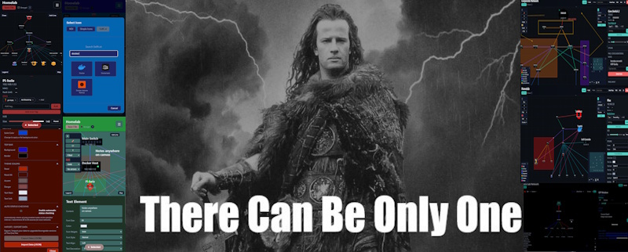

# The One File
- In the end there can only be "The ONE File". A portable, self contained network topology planner designed to remain usable when primary and secondary systems are unavailable. This file acts as the final layer in a 1-2-3 backup strategy and provides an editable workspace for documenting homelabs, office networks, and production environments.

## Key Features
- Editable, single html file topology and planning document  
- Portable and lightweight for remote or constrained environments  
- Supports homelabs, enterprise layouts, and hybrid infrastructures  
- Structured for repeatable documentation workflows  
- Durable fallback reference in disaster recovery scenarios

## Use Cases
- Designing new network topologies  
- Documenting existing infrastructure for audits  
- Planning migrations, upgrades, or expansions  
- Emergency reference when standard systems are offline  
- Homelab organization and lifecycle tracking  
- Onboarding or knowledge transfer

## Why It Exists
When both primary and secondary planning tools fail, this file remains available. It requires no external services, making it suitable as a final backup for continuity and recovery.